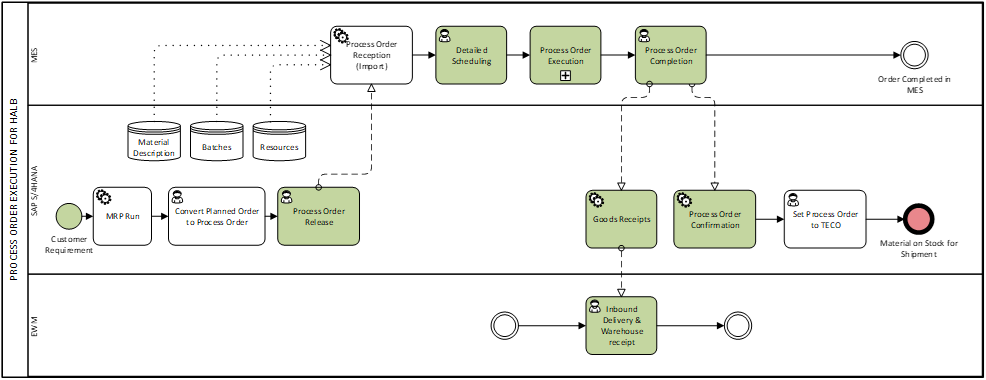

# MES-connection-testing
Connectivity testing from MES to SAP and workflow simulation
# 1 INTRODUCTION AND SCOPE

This blueprint describes the integration between the Manufacturing Execution System (MES) and SAP systems (SAP S/4HANA ERP and EWM) for ACME Pinghu project from MES Perspective. The New Chemical Plant in Pinghu consists of approximately 8 production areas (process Technologies), each with several work centers. The integration design focuses on a function-based MES (i.e. an MES solution defined by required functionality rather than a specific vendor platform) working in tandem with SAP S/4HANA (ERP) and SAP EWM as the warehouse Management System (WMS), and a function-based MES.

All MES-ERP-EWM exchanges will be routed through SAP S/4HANA as the central integration point – There is no direct communication between MES and EWM. Any warehouse-related interactions (e.g. inventory updates or handling unit receipts) will occur via the ERP layer. The MES internal functionalities are out of scope for this document; in the process flow diagrams the MES’s execution steps are represented as a collapsed subprocess block (e.g. “Process Order Execution”) to keep the focus on integration data exchanges between MES and SAP.

**Objectives**

The primary goal of this blueprint is to define a standard, scalable integration approach between ERP, WMS, and MES for new (greenfield) manufacturing sites. It will serve as a foundation for future projects by reusing modular interfaces and proven data flows. Key objectives include:

- Foundation for Future Projects: Create a template integration design that can be replicated, speeding up implementation and reducing risk in subsequent rollouts.
- Standardized Modular Interfaces: Define clear, reusable technologies interfaces between SAP and MES, ensuring consistency and easier maintenance across projects.
- Scalability and flexibility: Ensure the solution can scale to additional production lines or sites and can adapt to increased volume or complexity without redesign

**Intended Audience:**

This document is intended for both business, OT and IT stakeholders involved in SAP-MES integration projects. This includes:

- SAP Demand-to-Supply (DTS) global and regional process owners (responsible for supply chain processes)
- Regional Business Team (RBT) members coordinating SAP project implementation.
- SAP Technical Integration specialists (for APIs and middleware)
- Local IT infrastructure teams
- EWM Manager (warehouse system lead)
- MES Manager (manufacturing execution lead)
- MES Functional Engineer (MES process designer)
- API Software Developer (responsible for building/customizing interface code)
- OT Pinghu Project Manager

# 2 PROJECT IMPACT AND DELIMITATION

**Business Benefits:**

Implementing a robust MES-ERP-EWM integration for Pinghu will give several business benefits:

- Error Reduction & Data Accuracy: Automating data exchange between MES and SAP will minimize manual data entry and transcription errors. Consistent master data and real-time transaction integration improve the accuracy of production and inventory data, providing a “single source of truth” for operations. Fewer errors and more reliable data boosts confidence in the information used for decision -making.
- Visibility & Traceability: The integration provides end-to-end visibility of production and inventory movements. For example, production order execution status and material consumption will be visible in SAP in real time, and MES will have up-to-date inventory information from SAP. This improves product traceability throughout the supply chain, from raw materials to finished goods. Enhanced traceability not only aids in quality control and regulatory compliance but also allows rapid responsiveness (e.g. in case of recalls or audits).
- Scalability: A standardized interface architecture ensures that adding new production lines or even new plants in the region is straightforward. The Pinghu integration design can be extended to other sites with similar setup, maintaining consistent processes across locations. In essence, ERP-MES integration enables operational consistency across multiples facilities, so as production expands or new factories come online, the integrated systems can scale to support growth. This modular, reusable approach reduces the effort for future integrations and supports ACME’s digital transformation roadmap.

**Out of Scope:**

- Brownfield Integration Scenarios: This blueprint is tailored for a new implementation (greenfield project) in a facility with new systems and processes. Retro-fitting the integration into existing (“brownfield”) manufacturing sites with legacy systems is not covered. (In a brownfield scenario, additional considerations for legacy data migration, phased cut-overs, etc., would be needed, but those are excluded here.)
- MES Internal Functional Design: The document does not detail MES’s internal functional processes or logic. (For detailed MES functionality such as production sequencing, operator user interface, etc., refer to the Functional Design Specification of the MES) Here we limit the scope to information exchange between MES and SAP. The MES appears as a black-box executing the process order on the shop floor, with this blueprint only describing the inputs it receives from SAP and the outputs it sends back

# 3 WORKFLOWS

This section describes the two main integration workflows in scope: (a) Process Order Execution (production process integration) and (b) Material Staging (Line-side warehouse replenishment). For each workflow, we outline the sequence of interactions between SAP and MES, focusing on the exchange of messages and data. The MES’s internal steps are abstracted; the emphasis is on when and how MES and SAP communicate to keep data in sync.

## 3.1 Process Order Execution Workflow

**Overview:**

In this workflow, SAP S/4 triggers and tracks the execution of process orders on the MES. We consider 2 scenarios for process orders:

- Scenario 1: Process order producing an Intermediate (HALB) product – Typically a semi-finished material that will be used in further processing on-site.
- Scenario 2: Process order producing a Finished Good (FERT) – a final product that will be packaged and sent to the warehouse.

Figure 1. Scenario 1: HALB Process Orders

Figure 2. Scenario 2: FERT Process Orders

The integration steps are largely similar in both scenarios, with one key difference: the handling of **Goods Receipt (GR)**. For HALB orders, the goods receipt posted in SAP represents an internal movement of semi-finished stock (often to a production holding area) and usually does not involve packing the product into **handling units** or printing an **SSCC label** (unless in special cases where intermediates are also stored on pallets). For FERT orders, the goods receipt corresponds to completed product pallets that are ready for warehouse storage; this involves creating **Handling Unit (HU)** identifiers for each pallet, and printing **SSCC labels** to attach to those pallets. These HUs will be managed by EWM once handed over to the warehouse.

**Note:** In general, intermediates (HALB) will not be packed into handling units on the shop floor – they are typically transferred in bulk containers or bins for further processing. An **exception** may occur if an intermediate is produced in a form that requires temporary palletization. Such cases (e.g. a large batch of semi-finished material that needs to be stored before use) would involve handling units even for HALB. The integration design can accommodate this, as SAP’s production receipt process does support HUs for semi-finished products. *(I need to coordinate with SAP if any HALB products in Pinghu will be palletized with HUs, or if all intermediate receipts are non-HU).*

**Process Order Execution – Integration Steps:** Once a production order is initiated and executed, the following steps occur between SAP and MES:

| **No.** | **Step** | **System** | **Description** |
| --- | --- | --- | --- |
| 3.1.1 | Process Order Release | SAP -> MES | SAP S/4HANA (ERP) sends the released process order to MES as soon as the order is approved for production. This includes key details such as the material to produce, quantity, required date, and the target work center/resource. The order data is sent via a standardized API from SAP to MES. The MES receives the order and registers it in its production schedule. |
| 3.1.2 | Detailed Scheduling | MES | Upon receiving the order, MES performs detailed production scheduling and planning on the shop floor. (This occurs within MES and is not detailed here – e.g. MES might assign the order to a specific machine or sequence it among other orders. No SAP interaction is needed for this step aside from MES acknowledging order receipt.) |
| 3.1.3 | Planned Handling Units | SAP -> MES | For finished-product orders (FERT), SAP calculates the **planned packaging** for the order and sends the planned Handling Unit information to MES. This calculation is based on the total order quantity and the packing instructions maintained in SAP (e.g. how many kilograms per pallet or how many items per carton). The result is a set of planned HU identifiers (with predefined SSCC numbers) and their expected contents (quantity per pallet). SAP communicates these via the Handling Unit API (Version 1). MES receives the list of planned HUs and stores this, so it knows how many pallets (or other handling units) to expect when production is completed.
*(For HALB orders, this step may be skipped or result in a single “bulk” handling unit if no discrete pallets are planned.)* |
| 3.1.4 | MES Execution | MES | MES carries out the process order on the shop floor, guiding operator or automated equipment through production. This includes material consumption (picking of raw materials), processing, and possibly in-process quality checks. While MES is executing it may capture data like actual yield, times, and consumptions, but these details will be reported back to SAP in the confirmation step. |
| 3.1.5 | Production Completion & Label Printing | MES | When production of a pallet or the entire order is completed, MES prepares to perform goods receipt. For finished goods, MES will print the SSCC label for each completed pallet. The label format will follow ACME’s global standard (which includes the SSCC barcode and human-readable info like material, batch weight, etc.) The MES manages the printers on each packing line to ensure the correct label is printed at the correct station (for example, if there are multiple printers, the system ensures that the pallet produced on Line 1 gets its label from the Line 1 printer, and so forth). Each SSCC label corresponds to one Handling Unit. This step is purely on MES side (printing and physically labeling the pallet). *(It’s assumed the SSCC code on the label is the same HU number that was provided by SAP in step 3.1.3. MES uses the SAP-planned HU number to ensure consistency. I need to ask SAP for the exact template of SSCC label)* |
| 3.1.6 | Goods Receipt Posting | MES -> SAP | MES then triggers a Good Receipt (GR) in SAP for each completed pallet for batch. Essentially, once a pallet is finished and labeled, MES sends a message to SAP to post the production order confirmation and goods receipt for that quantity. For HALB orders MES might post one GR at order completion for the total quantity produced (since it may not be palletized in discrete units). For FERT orders, this will typically be done **pallet by pallet** – e.g. each time a pallet is completed, MES posts a GR for that pallet’s quantity, along with the HU number (SSCC) identifying it. The API used here is the **Goods Receipt** interface (MES -> SAP). This message includes production order reference, the quantity, the HU ID (if applicable), and possibly the batch number if a `new batch was created. |
| 3.1.7 | Inbound Delivery and Warehouse Receipt | SAP/EWM | Upon receiving the GR message from MES, SAP S/4 will record the goods receipt into inventory. In an SAP EWM-managed environment, the ERP is expected to create an Inbound Delivery to represent the goods arrived from production. This inbound Delivery will carry the HU information (Pallet IDs) and it should be available to EWM. (Warehouse operations like putaway are handled in EWM and are outside the scope of this document, but it’s important that the integration enabled EWM to receive the HU.) |
| 3.1.8 | Order Confirmation and Consumption Posting | MES -> SAP | MES sends a production order confirmation to SAP to indicate the order is completed (or to record progress if doing partial confirmations). This confirmation message includes the total produced quantity and the consumption of raw materials. In SAP terms, it will result in a production order confirmation record and backflush of components. Essentially, MES provides SAP with the actual quantity of each component that was consumed in the order and the actual output produced (which should match the sum of the pallets reported via GR). SAP posts the confirmation and consumption which will decrement raw material inventory in the ERP and mark the production order as complete. |

Throughout this process, SAP and MES remain in sync: SAP knows what orders are being executed and receives updates when production is done (inventory is updated). The result is a seamless flow where production data is digitized and shared in real time: operators execute processes with MES guidance, and SAP gets immediate modifications of production results (new stock, consumed components, etc.)

## 3.2 Material Staging Workflow

**Overview:**

This workflow covers the **line-side material staging process**, i.e. how raw materials and intermediate products are delivered from the warehouse to the production lines in advance of production. I the Pinghu setup, MES includes a line-side warehouse management module that monitors inventory levels at production storage locations (the storage areas near each production line). The goal is to ensure that each production area has sufficient raw materials, packaging, and semi-finished components to execute the scheduled orders for the next few days. The MES will calculate material needs and request replenishment from the main warehouse (managed by EWM via SAP S/4). The process involves generating a material staging request from MES and processing that request in SAP/EWM, then updating MES with the delivered quantities.

Only one main scenario is considered for staging: the MES request stock per production storage location, and EWM (via SAP) will fulfill the request by picking and delivering the materials. There may be some variations for fast-moving vs slow-moving materials (daily or weekly planning), but the integration steps remain the same. All communication again flows through SAP S/4 (no direct MES-EWM link).

**Material Staging – Integration Steps:**

| **No.** | **Step** | **System** | **Description** |
| --- | --- | --- | --- |
| 3.2.1 | Calculate Production Material Demand | MES | MES Continuously or periodically calculates the **material demand** for each production area’s storage location (often called Production Storage Location, SLoc, or sometimes equivalent to a Production Supply Area in SAP EWM terms). This calculation looks ahead a configurable horizon (e.g. the next 1 day, 2 days, or a week of scheduled orders) and sums up the required quantities of each component (raw material – ROH, packaging – VERP, or semi-finished – HALB) needed. Then it checks the current on-hand stock already available at that production location. The difference between the needed amount and current stock is in the **replenishment quantity**. This logic may also consider material categories: for example, fast-moving materials might be planned daily in smaller batches to avoid clutter, whereas slow-moving or rarely used materials might be staged less frequently or in exact amounts. (The precise planning rules can be configured in MES; MES has the intelligence to avoid overstocking while preventing line stoppages.) |
| 3.2.2 | Send Material Staging Request | MES -> SAP | MES compiles the list of required materials and quantities for each production storage location and send a Stock Replenishment Request to SAP S/4. This request essentially says, for example: “Workshop 1 Area 1 1st floor (SLoc 0101) needs 500 kg of Material ABC by tomorrow” and “Line 3 needs 20 boxes of Material XYZ,” etc., for all needed materials. Each request will specify the production storage location (destination) and the required quantity (which is shortfall = demand – current stock). *(I need to ask SAP when the Material Documents interface will be active to test it).* |
| 3.2.3 | Warehouse Pick & Stage | SAP EWM | Once SAP receives the staging request, the warehouse processes it. In an SAP EWM-managed warehouse, this likely involves creating a warehouse task or outbound delivery order for the main warehouse to the production supply area. EWM will decide how to fulfill the request for each material:
·         If the requested quantity is close to a full pallet, EWM might round up to send a full pallet (especially for bulk materials or fast movers) to simplify handling. For example if MES requested 450 kg and a full pallet is 500 kg, EWM might send one full pallet (500 kg) rather than breaking a pallet.
·         For smaller or precise requests, EWM can pick the exact quantity (or a suitable unit of packaging). This logic is based on material-specific settings or warehouse operator decisions. The key is EWM has flexibility to optimize the delivery (Clas A materials might be sent in full pallet increments, class C in exact amounts, etc.).
·         EWM executes the picking in the warehouse, then *stages* the materials to the specified production storage location (which physically might be a drop-off point at the line or a small buffer area).
·         In SAP terms, when the stock is moved, an Inventory Management (IM) goods movement occurs (likely a transfer posting from main storage location to the production storage location). If any material is considered consumed or scrapped during this (for example, if some stock was expensed or scrapped), those movements would also be handled. The exact confirmation method on SAP side might be via scanning barcodes at the production area or manual confirmation in EWM *(I need to ask SAP how the warehouse team will confirm the goods movement to the production area – e.g. will they use handheld scanner transactions in EWM to confirm that materials have been placed into the production storage location? Or will it be an automated posting when the truck leaves the warehouse? This detail affects when the next message is sent.)*. |
| 3.2.4 | Inventory Update to MES | SAP -> MES | After the requested materials have arrived at the production area and the warehouse operation is completed, SAP/EWM sends a message to MES with the **actual quantities delivered** (per material and location). This is important so that MES can update its line-side inventory records and know exactly how much stock is available at each production line. The interface for this is an **Inventory Update (Stock Change)** message from SAP to MES. (API XXX). Once EWM confirms the delivery (for instance, confirms the outbound delivery or closes the warehouse task), SAP S/4 will generate an inventory movement that can be captured. The MES will receive this, typically in the form of a material document read or a push notification, indicating for example: “300 kg of Material ABC has been delivered to Workshop 1 Area 1 1st floor (SLoc 0101)”. MES then updates its on-hand inventory for that production location accordingly. At this point, ownership of the stock shifts to production: the production team (via MES) is now responsible for that material until it’s consumed in manufacturing. The warehouse’s job is done until a new request comes or unused material is returned. |

By completing these steps, the line-side material staging is fully integrated. MES ensures production will not starve for materials by proactively requesting stock; SAP EWM ensures optimal delivery from the warehouse; and both systems stay synchronized on inventory. Production operators will see the materials available in MES (after step 3.2.4), and SAP/EWM inventory will show those quantities in the production storage location (considered issued to prediction). This closed-loop avoids manual stock tracking on the shop floor and provides traceability of material movements.

# 4 INTERFACES: DATA EXCHANGE BETWEEN SAP AND MES

The following tables summarize the interfaces that will be implemented between SAP S/4 (ERP/EWM) and the MES for the Pinghu project. We categorize them into Master Data interfaces (initial and periodic data synchronization from SAP to MES) and Transactional Data interfaces (real-time exchanges during operations). Each interface is identified by the object it handles, the direction of data flow, the interface name, and which workflow(s) utilize the interface. All listed interfaces are considered Must-have for the solution (none are optional for the Pinghu scope)

## 4.1 Master Data Exchange

Master data interfaces are one-way (SAP->MES) and ensure that MES has the necessary foundational data from SAP to operate correctly. Master data is typically loaded initially and then kept in sync via updates. Pinghu MES will receive material definitions, batch data, resource definitions, etc., from SAP. (No master data is created in MES that needs to flow back to SAP in this design.)

| **No.** | **Object** | **Direction** | **Interface Name** | **Version** | **Workflow** |
| --- | --- | --- | --- | --- | --- |
| 4.1.1 | Material Master | SAP -> MES | Materials (Material Master) | V3 | All workflows |
| 4.1.2 | Batch Master | SAP -> MES | Batch (Batch Data) | V1 | Production (batch tracking) |
| 4.1.3 | Resources (Work Centers) | SAP -> MES | Resources (Work Center Master) | V1 | Process Order Execution (Scheduling) |
| 4.1.4 | Packaging / Handling Unit Spec* | SAP -> MES | Planned HU for Order (Packaging Instruction) | V1 | Process Order Execution (FG orders) |
- Note: “Planned HU for Order” refers to SAP sending the planned Handling Unit details (HU numbers and quantity per HU) for a process order. This is technically transactional (specific to each order) but it is listed here as it’s sent upfront before execution. It is important for the MES to know expected pallet configurations.

## 4.2 Transactional Data Exchange

Transactional interfaces support the ongoing operations, sending order execution updates, inventory movements, and confirmations between MES and SAP. These are typically messages triggered by events (order release, order completion, stock depletion, etc.) and are often near real-time.

| **No.** | **Object** | **Direction** | **Interface Name** | **Version** | **Workflow** |
| --- | --- | --- | --- | --- | --- |
| 4.2.1 | Process Order | SAP -> MES | Process Order (Production Order) | V2 | Process Order Execution (start) |
| 4.2.2 | Process Order Confirmation | MES -> SAP | Process order confirmation (With Consumption) | V1 | Process Order Execution (Completion) |
| 4.2.3 | Goods Receipt (Finished Goods) | MES -> SAP | Goods Receipt (Production GR) | V1 | Process Order Execution (FG pallets) |
| 4.2.4 | Handling Unit (Production) | SAP -> MES | Handling Unit (Planned HU info) | V1 | Process Order Execution (FG pallets) |
| 4.2.5 | Material Staging Request | MES -> SAP | Material Staging Request (Stock Transfer) | Material Documents (Create) | Material Staging |
| 4.2.6 | Inventory Update (Stock Change) | SAP -> MES | Inventory Update Notification (e.g. 411, 551 movement) | Material Documents (Read) |  |

# 5 TERMINOLOGY AND DEFINITIONS

In this section, we define key terms and acronyms used in the blueprint to ensure clarity for all readers (both SAP and non-SAP professionals).

| **Term / Acronym** | **Definition** |
| --- | --- |
| AEP | Refers to ACME’s SAP S/4HANA ERP system environment used in this integration. (Internal name “AEP” for the SAP application platform in this project.) |
| API | Application Programming Interface – a set of definitions and protocols for building and integrating application software. In this context, refers to the web services or interfaces provided by SAP or MES for data exchange. |
| Batch (SAP) | A specific subset of material defined by the same production conditions. In SAP, a Batch is identified by a unique batch number and typically corresponds to one production lot of a material (with certain attributes like manufacture date, shelf life, etc.). Batch management allows traceability of when and how a particular quantity of product was made. |
| Brownfield Project | In manufacturing IT, a project that implements new systems in an existing facility or on existing processes. It involves integrating or upgrading legacy equipment and software. (For example, adding MES to an older factory with established processes). Brownfield projects must account for existing infrastructure and data. (Contrast with Greenfield project.) |
| Greenfield Project | project that starts from scratch on a new site or with a new operation, without constraints of prior systems. In manufacturing, a greenfield implementation involves new equipment and systems designed for modern digital integration. Pinghu is treated as a greenfield digital integration (even if the physical plant exists, the systems are new). |
| Demand-to-Supply (DTS) | In ACME’s organization, “DTS” refers to the end-to-end process domain of planning and supply chain execution (from demand planning to supplying the product). A DTS team oversees business processes and SAP configuration for production and logistics. |
| EWM | Extended Warehouse Management – SAP’s advanced warehouse management system. It manages warehouse processes like picking, putaway, packing, physical inventory, and so forth. In this project, EWM handles the warehouse operations for raw materials and finished goods, tightly integrated with SAP S/4HANA (which handles inventory accounting). |
| FERT | Finished Product (in SAP material type code). These are end-products manufactured in-house, intended for sale or final use. In our context, a FERT is a finished good that, after production, gets packaged and moved to the warehouse as sellable inventory. |
| HALB | Semi-Finished Product (SAP material type code “HALB”). A product that is partially processed and will be used as input into a subsequent production step. HALB items are produced in-house (or procured) and typically are intermediate materials in a multi-step production process. |
| HU (Handling Unit) | A physical unit of goods packaged together, identified by a unique number in SAP. It consists of a load carrier (pallet, box, etc.) and the material contained. Handling Units allow tracking of those goods as a single entity. Each HU has a unique, scannable ID, often an SSCC barcode. In this project, finished goods pallets are managed as HUs. |
| IM (Inventory Management) | The SAP module/functionality that handles stock quantities and movements at the storage location level (part of SAP S/4HANA core). IM movements include goods receipts, goods issues, transfer postings, etc., identified by movement types (e.g. 101 for GR, 261 for consumption). IM in SAP is integrated with EWM (in an embedded EWM scenario, IM reflects the book quantity while EWM manages the detailed bin location). |
| MES | Manufacturing Execution System – the software that manages and monitors shop-floor production processes in real time. MES bridges the gap between the production line and business systems, handling tasks such as scheduling, work instructions, data collection, and production reporting. In this blueprint, MES is a function-based solution that will coordinate the execution of process orders and material staging. |
| Process Order | A type of production order used in process industries (like chemicals, coatings, etc.) to produce a batch of product. A process order contains the recipe or formula (operations/phases and ingredients) needed for production. It is created from a master recipe and is used to plan and execute the manufacturing of a batch of material. In SAP PP-PI, process orders are analogous to production orders but tailored for process industry needs (including batch-managed output and often continuous processes). |
| Production Storage Location (SLoc) | A storage location in SAP that represents a physical staging area at the production line. Materials are issued from the main warehouse to this location so they are on-hand for production. In EWM, a Production Supply Area (PSA) corresponds to this location. Each production area might have one or more dedicated storage locations for line-side inventory. |
| RBT (Regional Business Team) | A regional team that coordinates business requirements and implementation for projects. They liaise between local sites and global IT, ensuring the solution meets regional needs. In this context, the RBT supervises the SAP rollout and integration in the Asia Pacific region, including Pinghu. |
| ROH | Raw Material (SAP material type “ROH”). These are procured externally and used in production. Raw materials have purchase and inventory data but typically no sales data in SAP. E.g., chemical ingredients, base resins, etc., used by ACME to manufacture products. |
| Resource (Work Center) | In SAP, a Work Center (often called Resource in MES contexts) is a manufacturing resource – could be a production line, machine, or group of machines – where operations are carried out. It has capacity and scheduling data. In this project, a resource represents one or more physical mixers or equipment units that can execute a process order. MES dispatches orders to specific resources. (For example, if three mixers can produce the same formula, they are all represented under one work center in SAP, and MES decides which actual mixer to use for a given order based on availability, avoiding cross-contamination etc.) |
| SSCC | Serial Shipping Container Code – a standardized 18-digit number used to uniquely identify logistic units (like pallets) worldwide. SSCC is usually encoded as a barcode (GS1-128 standard) on pallet labels. ACME uses SSCC labels on each pallet (handling unit) of finished goods, allowing traceability through the supply chain. In this integration, SSCCs are generated by SAP (as HU numbers) and printed by MES on the pallet labels. |
| Warehouse Task | A task in EWM representing work to move materials in the warehouse (e.g., pick 5 bags of material X from bin A and move to bin B). It’s a core element of EWM execution. In staging, warehouse tasks are created to move stock from warehouse bins to the production supply area. |
|  |  |

Comments

For HALB process, GR will happen automatically during order confirmation, so there will not be separate GR interface. Unless the HALB is go in into warehouse, then GR by handling unit has to be done thru interface.